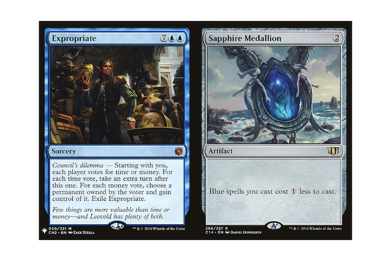

Convert [mtgprint.net](https://mtgprint.net/) output to 6x4 to send to photo print

Costs are ~10c/card + ~10c/card for reusable backing

- download this repo & install ruby
- build a deck 
- generate A4 from [mtgprint.net](https://mtgprint.net/) with black corners
- download as deck.pdf
- drop into this folder
- run `ruby split.rb` to split into 6x4s with 2 cards each
- print `print/*.png` at your local drug store
- [cut](https://www.amazon.com/gp/product/B016LDV41S)
- optional: [backing](https://www.amazon.com/dp/B09DLC3HTR)
- optional: [round corners](https://www.amazon.com/gp/product/B0076FJ7SS)
- play
